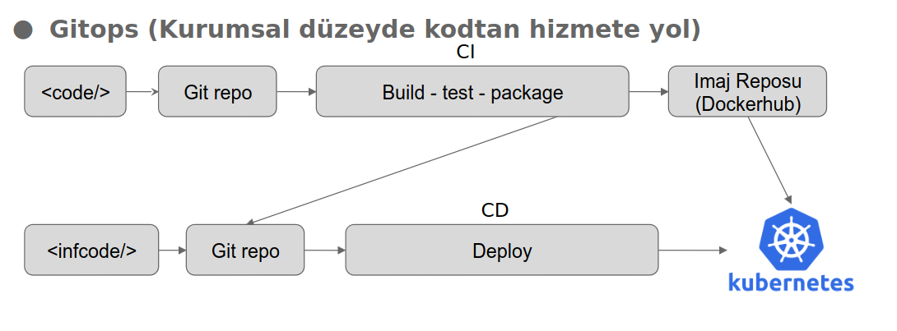
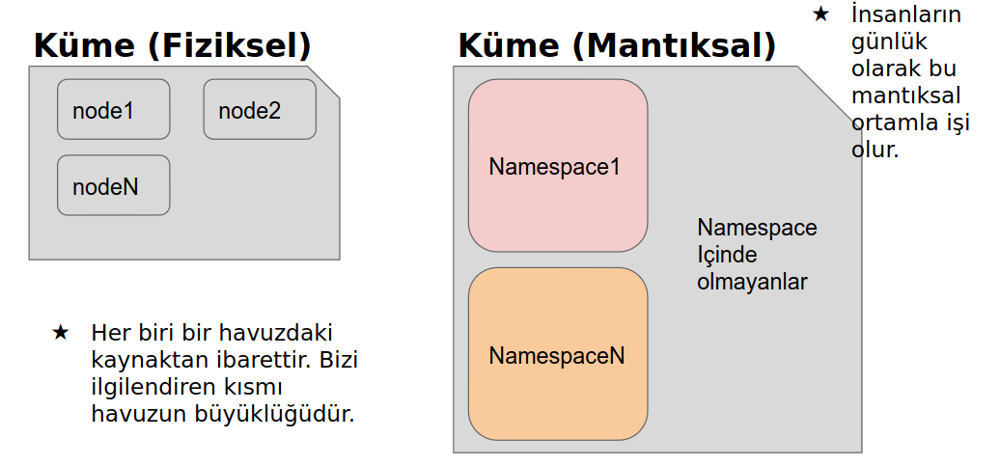
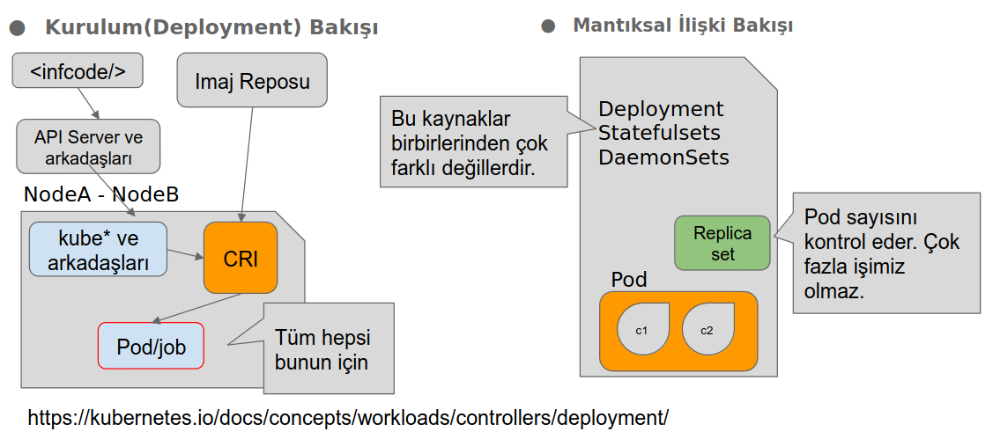
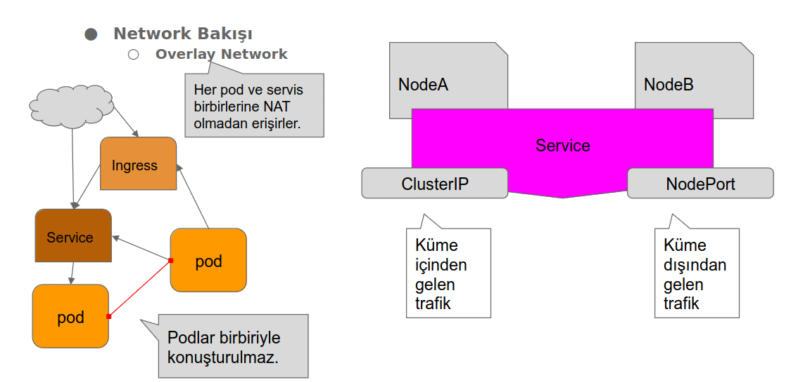

## Gitops Nedir?

Altyapıyı ve uygulama dağıtımlarını bir Git deposu üzerindeki belgelere ve yapılandırma dosyalarına dayanarak yönetme ve otomatikleştirme yaklaşımıdır.

## Kubernetes Gitops Akışı

## Kubernetes Mantıksal Yapı

## Kaynaklar

https://azuredays.com/2020/12/09/understanding-kubernetes-workload-objects/