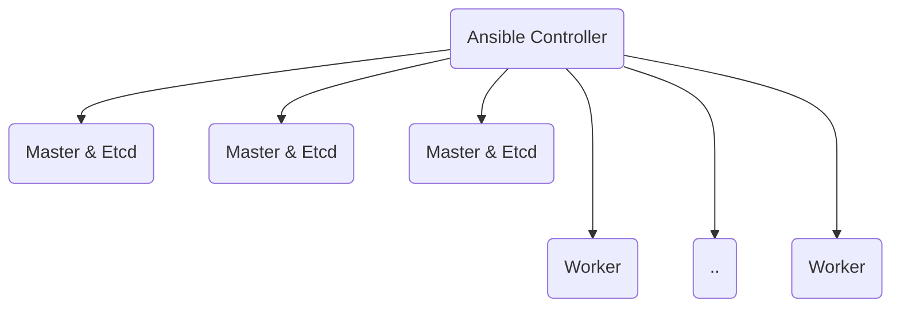
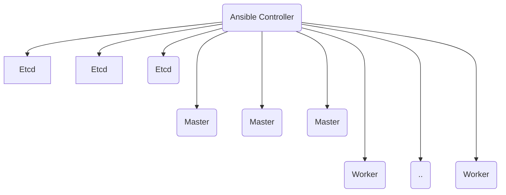

# kubespray

[Resmi Sitesi](https://github.com/kubernetes-sigs/kubespray)

Kubespray kubernetes kurulum ve bakımlarını otomatikleştiren, ansible üzerine geliştirilmiş, resmi bir araçtır.

Sağladıkları:

* Otomasyon
* HA:  https://github.com/kubernetes-sigs/kubespray/blob/master/docs/ha-mode.md
* node ekleme ve çıkarma, güncelleme
* Eklenti ekleme, çıkarma

## Kurulum




---

## Desktop Ortama Kurmak (Bonus)

Kendi ortamımızda test etmek istiyorsak [vagrant](vagrant.md) dosyasındaki vagrant ve virtualbox araçlarıyla hızlıca deneyebiliriz.

---

* Ansible kontrol makinası WSL ya da bir linux makinası olmak zorundadır. 
* Sunucular arasındaki erişimler için [buraya](https://kubernetes.io/docs/reference/ports-and-protocols/) uyulmak zorundadır.

Kontrol makinasında pip3'ün kurulu olması gerekir.

* ``requirements.txt``ye göre gerekenleri kurun.

```
sudo pip3 install -r requirements.txt
```

* ``inventory/sample`` hazır şablonunu ``inventory/mycluster`` olarak kopyala

```
cp -rfp inventory/sample inventory/mycluster
```

* Kubernetes kuracağınız sunucuların listesini Ansible'a veriyoruz.

```
declare -a IPS=(<server1_ip> <server2_ip> <server3_ip>)
CONFIG_FILE=inventory/mycluster/hosts.yaml python3 contrib/inventory_builder/inventory.py ${IPS[@]}

```

* ``inventory/mycluster/group_vars`` klasörü altındaki bu dosyaları gözden geçirin, değiştirmek istediklerinizi değiştirin. 

```
cat inventory/mycluster/group_vars/all/all.yml
cat inventory/mycluster/group_vars/k8s_cluster/k8s-cluster.yml
```

* Ansible ile Kubespray'i çalıştırın ve Kubernetes kümenizi kurun. Burada sudo yetkisine sahip bir kullanıcı gerekmektedir. Eğer sunuculara parola ile erişiyorsanız ``-kK`` size erişim parolası ve sudo parolasını soracaktır.

```
ansible-playbook -i inventory/mycluster/hosts.yaml  --become --become-user=root cluster.yml
ansible-playbook -i inventory/mycluster/hosts.yaml -b cluster.yml -u <kullanıcı> -kK
```
*  Eksik bir şey yoksa yukarıdaki IPS tanımında verilen sunuculara kubernetes kümesi kurulacaktır. 

## Yeni nod ekleme

```
declare -a IPS=(<server1_ip> <server2_ip> <server3_ip> <yeni_nod_ip>)
CONFIG_FILE=inventory/mycluster/hosts.yaml python3 contrib/inventory_builder/inventory.py ${IPS[@]}

ansible-playbook -i inventory/mycluster/hosts.yaml -b cluster.yml -u <kullanıcı> -kK --limit=kube_control_plane
```
## [Dashboard ve yeni eklenti kurma](dashboard.md)

* Kaynaklar
[Node Ekleme, Değiştirme](https://github.com/kubernetes-sigs/kubespray/blob/master/docs/nodes.md)