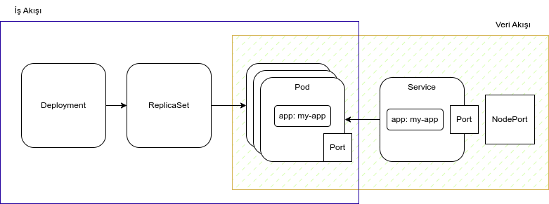

# Service

Kubernetes'de, pod'ların IP adresleri dinamik olarak değişebilir. Bu, uygulama içindeki hizmetlerin (servislerin) pod'ların IP adresleri yerine, adlarına göre erişilebilir olması gerektiği anlamına gelir. Bu sorunu çözmek için Kubernetes "Service" adında bir yapı kullanır.

Service, belirli bir pod veya pod grubunu temsil eder ve bir hizmet için sabit bir IP adresi ve DNS adı sağlar. Bu IP adresi ve DNS adı, pod'ların dinamik IP adresi değişse bile sabit kalır. Bu sayede, Service aracılığıyla uygulama içindeki hizmetlere erişmek mümkün hale gelir.

Service, aynı zamanda, uygulamanın dış dünyadan erişilebilir hale getirilmesine de olanak tanır. NodePort, LoadBalancer veya ExternalName gibi farklı servis türleri kullanılarak, Service, uygulamanın farklı bileşenlerine dışarıdan erişim sağlar.

Service, Kubernetes'teki önemli yapı taşlarından biridir ve uygulama içindeki hizmetlerin yönetimini kolaylaştırır. Service, pod'ların IP adreslerinin dinamik olarak değişebilmesi nedeniyle ortaya çıkan sorunları çözer ve uygulamanın dış dünyadan erişilebilir hale getirilmesine olanak tanır.





* deployment

```yaml

apiVersion: apps/v1
kind: Deployment
metadata:
  name: my-app-deployment
  labels:
    app: my-app
spec:
  replicas: 3
  selector:
    matchLabels:
      app: my-app
  template:
    metadata:
      labels:
        app: my-app
    spec:
      containers:
      - name: my-container
        image: my-image

```

* service

```yaml
apiVersion: v1
kind: Service
metadata:
  name: my-app-service
  labels:
    app: my-app
spec:
  type: LoadBalancer
  selector:
    app: my-app
  ports:
  - protocol: TCP
    port: 80
    targetPort: 8080
    
```


**Yapı** 

https://medium.com/avmconsulting-blog/service-types-in-kubernetes-24a1587677d6

https://octopus.com/docs/deployments/kubernetes/deploy-container

https://matthewpalmer.net/kubernetes-app-developer/articles/service-kubernetes-example-tutorial.html


Uygun ad alanına geçin
```sh
kubectl config set-context --current --namespace=myspace
```
Deploymentları kontrol edin.

```sh
kubectl get deployments

NAME                      READY   UP-TO-DATE   AVAILABLE   AGE
quarkus-demo-deployment   3/3     3            3           8m33s

# rsleri kontrol edin
kubectl get rs

NAME                                 DESIRED   CURRENT   READY   AGE
quarkus-demo-deployment-5979886fb7   3         3         3       8m56s

# podlara bak

kubectl get pods

NAME                                       READY   STATUS    RESTARTS   AGE
quarkus-demo-deployment-5979886fb7-c888m   1/1     Running   0          9m17s
quarkus-demo-deployment-5979886fb7-gdtnz   1/1     Running   0          9m17s
quarkus-demo-deployment-5979886fb7-grf59   1/1     Running   0          9m17s
```

Bir servis oluşturun. 

```sh
cat <<EOF | kubectl apply -f -
apiVersion: v1
kind: Service
metadata:
  name: the-service
spec:
  selector:
    app: my-app
  ports:
    - protocol: TCP
      port: 80
      targetPort: 8080
  type: NodePort 
EOF

# durumunu izliyoruz.
watch kubectl get services

NAME    TYPE           CLUSTER-IP      EXTERNAL-IP   PORT(S)          AGE
myapp   LoadBalancer   172.30.103.41   <pending>     8080:31974/TCP   4s
```
