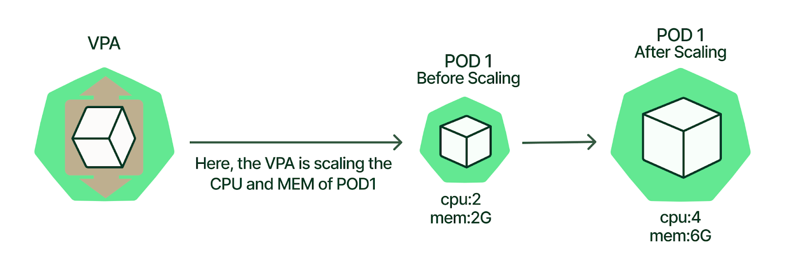

## vpa (vertical pod autoscaler)

Geçmiş kaynak kullanımlarına göre CPU ve bellek isteklerini ve bölmelerin sınırlarını otomatik olarak ayarlayan bir araçtır. 
Amaç: Kaynakları podlara ihtiyaç duyulduğu zaman vermek.

### Nasıl Çalışır?

* Bir kümedeki podların kaynak kullanımını izler. 
* Bu bilgiyi CPU ve bellek isteklerinin ve bölme sınırlarının nasıl ayarlanacağına karar vermek için kullanır. 
* Bu öneriler daha sonra Kubernetes API tarafından bölmelere uygulanır.

VPA kullanmanın faydaları:

* Geliştirilmiş kaynak kullanımı: VPA, kaynakları onlara ihtiyaç duymayan bölmelerde israf etmeden, ihtiyaç halinde onlara sağlar.
* Azalan maliyetler: Kubernetes kümesini çalıştırmanın maliyetini azaltır.
Basitleştirilmiş yönetim: VPA, kaynak isteklerini ve sınırlarını ayarlama sürecini otomatikleştirerek Kubernetes kümelerinin yönetimini basitleştirmeye yardımcı olabilir. Performansı yönetmeyi kolaylaştırır. 



```bash

git clone https://github.com/kubernetes/autoscaler.git

$ cd autoscaler/vertical-pod-autoscaler

./hack/vpa-process-yamls.sh print

./hack/vpa-up.sh

# yada

# https://github.com/kubernetes/autoscaler/tree/master/vertical-pod-autoscaler#notice-on-crd-update-100


```

### örnek

* https://github.com/kubernetes/autoscaler/tree/master/vertical-pod-autoscaler
* https://docs.aws.amazon.com/eks/latest/userguide/vertical-pod-autoscaler.html

### Diğer

* https://blog.kubecost.com/blog/requests-and-limits/
* https://www.kubecost.com/kubernetes-autoscaling/kubernetes-hpa/