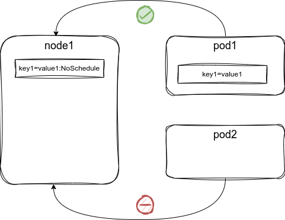

# taints & affinity

Bir Kubernetes Düğümüne, zamanlayıcıya belirli Bölmelerden kaçınması veya planlamaması için sinyal gönderen bir ``taint`` (engel veya uzaklaştırma) uygulanır.

Bir Pod tanımına bir ``toleration`` uygulanır ve ``taint`` için bir istisna sağlar.

## 

Kubernetes'te, "taints" ve "tolerations" mekanizması, belirli pod'ların belirli node'larda çalışmasını yönetmek için kullanılır. "Taints" bir node'a eklenirken, "tolerations" bir pod'un tanımına eklenir.



### Taints
"Taint" bir node'a uygulanır ve anahtar, değer ve etki üçlüsünden oluşur. Bu, belirli pod'ların bu node üzerinde çalışmasını önleyebilir veya kısıtlayabilir.

Örneğin, bir node'yu sadece belirli pod'ların bu node üzerinde çalışmasına izin vermek için "taint" edebilirsiniz:

```shell
kubectl taint nodes <node-name> key1=value1:NoSchedule
```

Bu komut, `<node-name>` adlı node'a bir "taint" ekler. `NoSchedule` etkisi, bu "taint"e uygun bir "toleration" olmadan pod'ların bu node üzerinde planlanmamasını sağlar.

### Tolerations
"Toleration" bir pod tanımına eklenir ve bir veya daha fazla "taint"e karşı dayanıklılık sağlar. Pod tanımına "toleration" eklemek için, pod tanımının YAML dosyasını düzenleyebilir veya bir manifest dosyasında belirtebilirsiniz:

```yaml
apiVersion: v1
kind: Pod
metadata:
  name: mypod
spec:
  tolerations:
  - key: "key1"
    operator: "Equal"
    value: "value1"
    effect: "NoSchedule"
  containers:
  - name: mycontainer
    image: myimage
```

Bu örnekte, "mycontainer" adlı konteyneri içeren "mypod" adlı bir pod tanımlanmıştır. Pod, anahtar "key1", değer "value1" ve etki "NoSchedule" olan bir "taint"e karşı bir "toleration" içerir.

### Özet
Bu yapı, pod'ların belirli node'larda çalışmasını yönlendirebilir. Örneğin:

1. **Belirli Node'larda Sadece Belirli Pod'ların Çalışmasını Sağlamak:** Özel donanımlara veya kaynaklara sahip node'lar için kullanışlıdır.
2. **Pod'ların Çalıştırılmasını İstemeyen Node'lara Taint Eklemek:** Bu node'lara sadece bu taint'leri tolere eden pod'lar yerleştirilir.

Etki türleri arasında `NoSchedule`, `PreferNoSchedule` ve `NoExecute` bulunur ve her biri pod'ların planlanması ve çalıştırılması üzerinde farklı etkilere sahiptir.

## Affinity

```yaml

apiVersion: apps/v1
kind: Deployment
metadata:
  name: node-affinity-demo
spec:
  replicas: 1
  selector:
    matchLabels:
      app: node-affinity-app
  template:
    metadata:
      labels:
        app: node-affinity-app
    spec:
      affinity:
        nodeAffinity:
          requiredDuringSchedulingIgnoredDuringExecution:
            nodeSelectorTerms:
              - matchExpressions:
                  - key: kubernetes.io/e2e-az-name
                    operator: In
                    values:
                      - e2e-az1
                      - e2e-az2
          preferredDuringSchedulingIgnoredDuringExecution:
            - weight: 1
              preference:
                matchExpressions:
                  - key: another-label-key
                    operator: In
                    values:
                      - another-label-value
      containers:
      - name: nginx-container
        image: nginx

```

**requiredDuringSchedulingIgnoredDuringExecution** 

Bir Pod'un planlanması (scheduling) ve çalıştırılması sırasında karşılaması gereken zorunlu node affinities (düğüm yatkınlıkları) tanımlar. Bu ayar, bir Pod'un hangi düğümlerde (nodes) çalışabileceğini sıkı bir şekilde sınırlar.

Aşağıdaki YAML kod örneğinde:

- `requiredDuringSchedulingIgnoredDuringExecution`: Bu, belirli bir node affinity'nin zorunlu olması gerektiğini belirten bir alandır. Bu, Pod'un sadece bu kriterlere uyan node'larda planlanabileceği anlamına gelir.
  
- `nodeSelectorTerms`: Bu, bir veya birden fazla `matchExpressions` setini içeren bir liste sağlar ve bu terimler arasında bir OR ilişkisi vardır. Yani, en az bir `nodeSelectorTerms` setinin karşılanması gerekmektedir.
  
- `matchExpressions`: Bu, belirli node'lara karşılık gelen etiketleri (labels) ve değerleri içerir.
  - `key`: Node üzerinde aranan etiketin adıdır.
  - `operator`: Etiket değerinin hangi kritere göre filtrelenmesi gerektiğini belirleyen operatördür. `In` operatörü, `values` alanında belirtilen değerlerden herhangi birine eşit olan etiketleri arar.
  - `values`: Aranan etiketin alabileceği değerler listesidir.

Yukarıdaki örnekte, `requiredDuringSchedulingIgnoredDuringExecution` bölümü, Pod'un `kubernetes.io/e2e-az-name` etiketi `e2e-az1` veya `e2e-az2` değerlerinden birine sahip node'larda çalıştırılması gerektiğini belirtir. Eğer bu kriterlere uyan bir node bulunamazsa, Pod planlanmaz veya başlatılmaz.

Bu ayarların adında "IgnoredDuringExecution" ifadesi bulunmaktadır çünkü bu kısıtlamalar yalnızca planlama (scheduling) aşamasında geçerlidir. Pod bir kere başlatıldıktan sonra, bu kısıtlamalar çalışma zamanı (runtime) sırasında yoksayılır. Bu da, node'un etiketlerinin değişmesi durumunda, Pod'un bu değişikliklere yanıt olarak yeniden planlanmayacağı anlamına gelir.


**preferredDuringSchedulingIgnoredDuringExecution** 

preferredDuringSchedulingIgnoredDuringExecution kısmı, Kubernetes'in Pod yerleştirme (scheduling) sırasında göz önünde bulundurması gereken tercih edilen kısıtlamaları (affinities) tanımlamak için kullanılır. Bu tercih edilen kısıtlamalar, Pod’un hangi Node’larda çalıştırılmasının tercih edildiğini belirtir, ancak bu kısıtlamalar zorunlu (mandatory) değildir. Bu, eğer tercih edilen kısıtlamalara uyan bir Node bulunamazsa, Pod’un bu kısıtlamalar dışındaki Node’larda da çalıştırılabileceği anlamına gelir.

Bu başlık altına bir veya daha fazla tercih edilen kısıtlama (affinity rule) tanımlanabilir. Her kısıtlama için bir weight ve bir preference tanımlanır.

- `weight`: Bu, tercih edilen kısıtlamanın ağırlığını belirtir. weight değeri 1 ile 100 arasında bir tamsayı olabilir. Daha yüksek ağırlığa sahip kısıtlamalar, scheduling sırasında daha fazla öncelik kazanır.

- `preference`: Bu, tercih edilen kısıtlamanın kendisini tanımlar. preference kısmı matchExpressions içerir, bu da bir veya daha fazla etiketle (label) eşleşme kuralı tanımlar.

- `matchExpressions`: Bu, key, operator ve values olmak üzere üç alana sahiptir.
    - `key`: Node etiketinin adını belirtir.
    - `operator`: In operatörü, belirtilen values listesindeki değerlerden herhangi birine eşit olan Node etiketlerini arar.
    - `values`: Node etiket değerlerinin beklenen listesidir.

* Buradaki kodda bir Node’un another-label-key etiketine sahip olması ve bu etiketin değerinin another-label-value olması tercih edilmektedir. Eğer bu kısıtlamaya uyan Node’lar mevcutsa, bu Node’lara sahip Pod’lar weight değerine göre önceliklendirilir. Eğer bu kısıtlamaya uyan Node’lar mevcut değilse, bu kısıtlama göz ardı edilir ve Pod, diğer uygun Node’larda yerleştirilebilir.