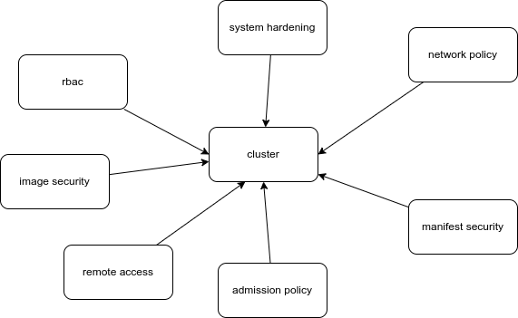

## Security Principles

*Defense in Depth
*Least Privilege
*Limiting the Attack Surface
 
# Steps
Reduce Attack Surface
Redundant Security Layer
Least Privilege

# Locations

* Application Security
* Kubernetes Cluster Security
* Host Operating System Security

### Host OS Security
* Kubernetes Nodes should only do one thing: Kubernetes
* Reduce Attack Surface
    * Remove unnecessary applications
    * Keep up to date
* Runtime Security Tools
* Find and identify malicious processes
* Restrict IAM / SSH access

### Cluster Security

* Kubernetes components are running secure and up-to-date
    * Apiserver
    * Kubelet
    * ETCD (ETCD trafik erişimini kapat)
        - master nodelarda workload çalışmasın
        - host servislerine erişimi kapat
* Restrict (external) access
* Use Authentication -> Authorization
* AdmissionControllers
    * NodeRestriction
    * Custom Policies (OPA)
* Enable Audit Logging
* Security Benchmarking

### Application Security

* Use Secrets / no hardcoded credentials
* RBAC
* Container Sandboxing
* Container Hardening
    * Attack Surface
    * Run as user
    * Readonly filesystem
* Vulnerability Scanning
* MTLS / ServiceMeshes

https://www.youtube.com/watch?v=wqsUfvRyYpw
