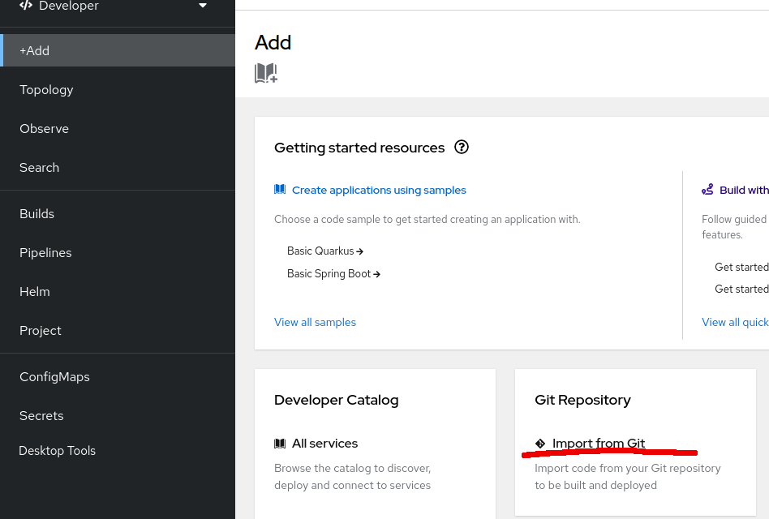
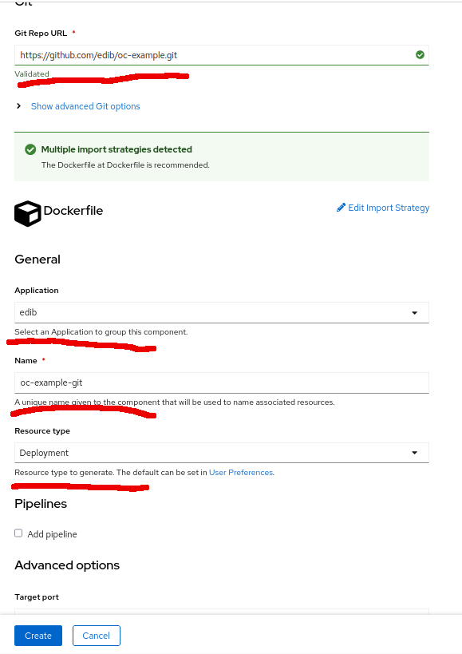
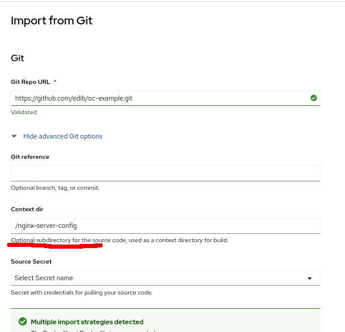
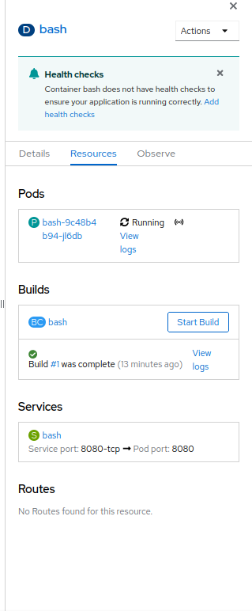

## Openhift build and push

Developer sandboxta üstte isminize tıklayınca copy login command butonundan tıklayarak alınabilir.


## github örneği

### Kullanılacak örnek

* https://github.com/edib/oc-example.git



* Application adını yeni oluşturuyoruz veya varolan birini seçiyoruz. 
* Deployment adını seçiyoruz.
* Resource type "Deployment seçiyoruz." 



Eğer alttaki bir klasörü kullanmak istersek



Burada uygulamaları görebiliriz.


"D bash" üzerine tıkladığımızda açılan sağdaki bölmede aşağıdaki gibi resources altında oluşan diğer kaynakları görebiliriz.




## oc kullanımı

```bash

oc login --token=<sizin_token> --server=<sizin-server-hostname>


oc whoami

podman login -u kubeadmin -p $(oc whoami -t) default-route-openshift-image-registry.apps-crc.testing --tls-verify=false

# eğer docker kullanılırsa (docker daemonda değişiklik gerekiyor)
docker login -u kubeadmin -p $(oc whoami -t) default-route-openshift-image-registry.apps-crc.testing


$ oc new-project demo

podman pull quay.io/libpod/alpine

podman tag alpine:latest default-route-openshift-image-registry.apps-crc.testing/demo/alpine:latest

podman push default-route-openshift-image-registry.apps-crc.testing/demo/alpine:latest --tls-verify=false

oc get is

$ oc run demo --image=alpine --command -- sleep 600s

```
